# SIRIO-MCP-BENCH: Quantitative Evaluation of MCP-Augmented LLMs on Stochastic Fault Tree Analysis

[](https://doi.org/10.1145/3837062.3839378)
[](https://creativecommons.org/licenses/by/4.0/)
[](https://www.oracle.com/java/)
[](https://www.python.org/)
[](https://modelcontextprotocol.io/)

This repository is the official **Replication Package** and **Extended Companion Documentation** for the paper:

> **Assessing the Impact of MCP-Augmented LLMs in MDE Tasks: A Quantitative Comparative Evaluation Framework on Fault Tree Modeling and Analysis Through Petri Nets**  
> *Filippo Sciammacca\*, Niccolò Menghini\*, Nicolò Pollini, Marco Becattini, Enrico Vicario*  
> Software Technologies Lab (STLab), Department of Information Engineering (DINFO), University of Florence, Italy.  
> **ACM/IEEE 29th International Conference on Model Driven Engineering Languages and Systems (MODELS Companion 2026)**, Málaga, Spain.  
> DOI: [10.1145/3837062.3839378](https://doi.org/10.1145/3837062.3839378)

---

## Table of Contents
1. [Overview & Research Motivation](#1-overview--research-motivation)
2. [Key Experimental Findings & Quantitative Results](#2-key-experimental-findings--quantitative-results)
3. [Deep-Dive: Failure Modes of the MCP Configuration](#3-deep-dive-failure-modes-of-the-mcp-configuration)
4. [Top-Down Probabilistic Fault Tree Generation](#4-top-down-probabilistic-fault-tree-generation)
5. [Model-to-Model Transformation Deep-Dive (FT $\to$ STPN)](#5-model-to-model-transformation-deep-dive-ft--stpn)
6. [Formal Stochastic Engine: Analytical Ground Truth via SIRIO](#6-formal-stochastic-engine-analytical-ground-truth-via-sirio)
7. [System Architecture & Polymorphic Implementation](#7-system-architecture--polymorphic-implementation)
8. [End-to-End Execution Flow & Multi-Turn State Machine](#8-end-to-end-execution-flow--multi-turn-state-machine)
9. [Dual-Level Evaluation Framework & Graph Isomorphism](#9-dual-level-evaluation-framework--graph-isomorphism)
10. [Prompt Engineering & Formal Semantic Guards](#10-prompt-engineering--formal-semantic-guards)
11. [Repository Structure & Java Framework Deep-Dive](#11-repository-structure--java-framework-deep-dive)
12. [Installation & Prerequisites](#12-installation--prerequisites)
13. [Step-by-Step Reproduction Guide](#13-step-by-step-reproduction-guide)
14. [Generating Custom Datasets & Extending the Benchmark](#14-generating-custom-datasets--extending-the-benchmark)
15. [Citation & Research Team](#15-citation--research-team)

---

## 1. Overview & Research Motivation

Integrating Large Language Models (LLMs) into **Model-Driven Engineering (MDE)** workflows is hindered by their fundamentally stochastic nature. While LLMs excel at syntax translation, structural pattern matching, and code generation, relying on their internal neural heuristics for mathematical, probabilistic, or dependability computations leads to severe cognitive biases, hallucinations, and uncalibrated arithmetic approximations.

> [!IMPORTANT]
> ### The Core Research Hypothesis
> **Decoupling Semantic Translation from Deterministic Execution**:
> Shifting the role of the LLM from an unreliable **"computational calculator"** to a **"semantic translator and planner"** via the [Model Context Protocol (MCP)](https://modelcontextprotocol.io/) enables delegating formal stochastic calculations to an external, deterministic numerical engine ([SIRIO](https://doi.org/10.1109/TSE.2019.2949806)). This architecture bridges the gap between neural heuristics and mathematical precision in dependability engineering tasks.

> [!WARNING]
> **Why Plain LLMs Cannot Be Trusted in Dependability Tasks**:
> Dependability and safety-critical engineering require mathematically certified bounds. In our empirical experiments, plain LLMs systematically hallucinated constant approximations (e.g. repeating $1.0$ across all time steps) or low-degree polynomials that only appear correct by statistical coincidence.

> [!NOTE]
> ### The Benchmark Design
> To empirically quantify this paradigm, `sirio-mcp-bench` provides an end-to-end quantitative benchmarking framework on **Stochastic Repairable Fault Trees (FTA)**:
> * **Analytically Exact Ground Truth**: Computes the exact steady-state unavailability $Q(\infty)$ and transient unreliability curve $Q(t)$ over a time horizon $[0, T]$ via automated translation into Stochastic Timed Petri Nets (STPNs) solved with the formal SIRIO numerical engine (regenerative transient analysis without Monte Carlo simulation).
> * **Plain LLM (Baseline / No-MCP)**: The model estimates $Q(\infty)$ and $Q(t)$ directly from the textual tree specification through pure internal reasoning.
> * **MCP-Augmented LLM (Treatment / MCP)**: The model is connected via MCP to a purpose-built server exposing **29 low-level atomic SIRIO modeling primitives** (places, transitions, stochastic rates, enabling conditions). The agent must **synthesize a semantically equivalent Petri Net** from scratch and delegate numerical solving. Crucially, the agent is *never* provided with the automated reference translation algorithm.

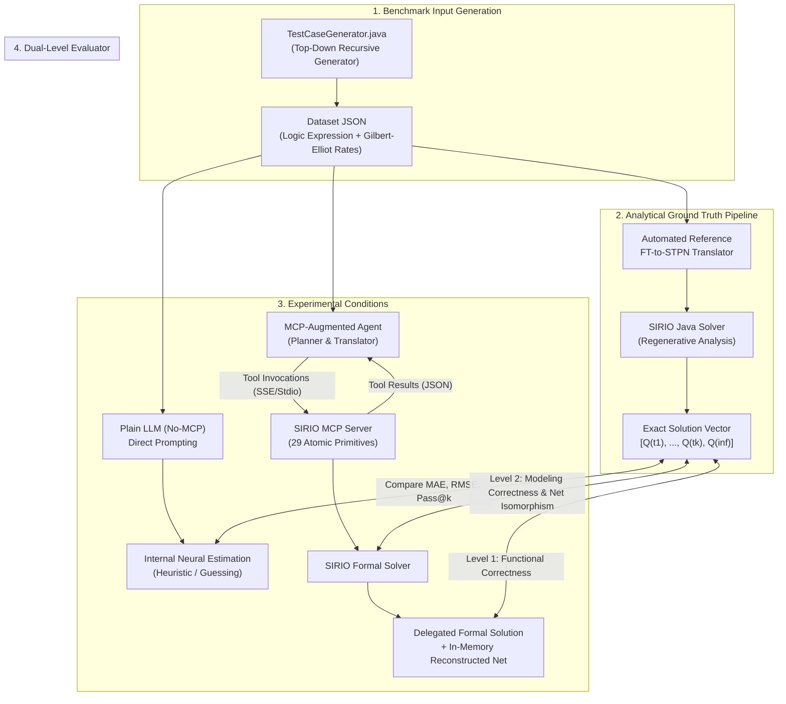

The flowchart above summarizes the entire end-to-end evaluation lifecycle. Starting from a parameterized Fault Tree input, the pipeline simultaneously derives an exact mathematical baseline using SIRIO and evaluates both the plain LLM and the tool-augmented MCP agent across dual evaluation pathways.

---

## 2. Key Experimental Findings & Quantitative Results

The benchmark was evaluated on a stratified dataset of **16 medium-tier Fault Tree cases**, each executed with **5 independent replications** ($N = 80$ runs per configuration) using **Qwen 2.5 Coder / Qwen 3.5 27B** at temperature $T = 0.2$.

### 2.1 Experiment Aggregated Data (Table 1 from Paper)

| Metric | No-MCP (Plain LLM) | MCP (Functional / End-to-End) | MCP (Modeling / Reconstruction) |
| :--- | :---: | :---: | :---: |
| **Pass@1 (Mean ± Std)** | 15.00% ± 21.79% | **63.75% ± 35.51%** | **87.50% ± 15.61%** |
| **Pass@2** | 25.00% | 76.88% | **98.13%** |
| **Pass@5** | 43.75% | 81.25% | **100.00%** |
| **Task Completion Rate** | 97.50% | 66.25% | **96.25%** |
| **Mean Latency (s)** | 216.9 ± 160.0 | 242.3 ± 87.8 | 242.3 ± 87.8 |
| **Steady-state MAE** | 0.622 ± 0.447 | **0.0095 ± 0.048** | **0.0130 ± 0.113** |
| **Transient MAE** | 0.346 ± 0.387 | **0.0018 ± 0.009** | **0.0040 ± 0.019** |
| **Transient RMSE** | 0.359 ± 0.395 | **0.0021 ± 0.010** | **0.0126 ± 0.048** |

### 2.2 Extended Benchmark Metrics (Produced in `report_summary.json`)

Beyond the high-level metrics published in the 5-page conference paper, the `sirio-mcp-bench` orchestrator generates granular statistical distributions across runs and topological classifications:

```text
===============================================================================================
 ACADEMIC BENCHMARK SUMMARY (Extended Output Format)
===============================================================================================
Metric                              | No-MCP           | MCP (Functional) | MCP (Modeling)  
-----------------------------------------------------------------------------------------------
Success/Exec Rate                   | 97.50%           | 66.25%           | 96.25%          
Pass@1 Accuracy (Mean)              | 15.00%           | 63.75%           | 87.50%          
Pass@1 Std Dev (across runs)        | 0.2179           | 0.3551           | 0.1561          
Pass@1 Std Dev (across cases)       | 0.2980           | 0.3120           | 0.1120          
Pass@2 Accuracy                     | 25.00%           | 76.88%           | 98.13%          
Pass@5 Accuracy                     | 43.75%           | 81.25%           | 100.00%         
Average Transient MAE               | 3.4600e-01       | 1.8000e-03       | 4.0000e-03      
Average Transient RMSE              | 3.5900e-01       | 2.1000e-03       | 1.2600e-02      
Average Steady Error                | 6.2200e-01       | 9.5000e-03       | 1.3000e-02      
Average Latency (s)                 | 216.90           | 242.30           | 242.30          
Max Turns Exceeded Rate             | 0.00%            | 3.70%            | N/A             
Tool Ignored Error Rate             | N/A              | 0.00%            | N/A             
Modeling Isomorphism Rate           | N/A              | N/A              | 87.50%          
Alternative Modeling Rate           | N/A              | N/A              | 8.75%           
Modeling Failure Rate               | N/A              | N/A              | 3.75%           
===============================================================================================
```

* **Pass@1 Std Dev (across runs vs across cases)**: Differentiates pure model stochasticity (run-to-run variance on the same problem) from problem-instance difficulty (case-to-case variance). For MCP Modeling, cross-run standard deviation drops to $0.1561$, indicating high stability.
* **Modeling Isomorphism Rate ($87.50\%$)**: The percentage of runs where the agent synthesized a Petri net strictly graph-isomorphic to the canonical reference model.
* **Alternative Modeling Rate ($8.75\%$)**: The percentage of runs where the agent built a structurally different but mathematically sound and semantically equivalent Petri net.
* **Modeling Failure Rate ($3.75\%$)**: Runs where the synthesized net had syntax/semantic errors (e.g. missing transitions or unbounded markings).
* **Tool Ignored Error Rate ($0.00\%$)**: Verifies that the agent never attempted to bypass available MCP tools when in treatment mode.

---

## 3. Deep-Dive: Failure Modes of the MCP Configuration

While the MCP agent achieves an exceptional **$100\%$ Pass@5** under Modeling evaluation, its end-to-end task completion rate drops to $66.25\%$. Qualitative and infrastructural analysis shows this decline is driven by four distinct failure modes (Table 2 from paper):

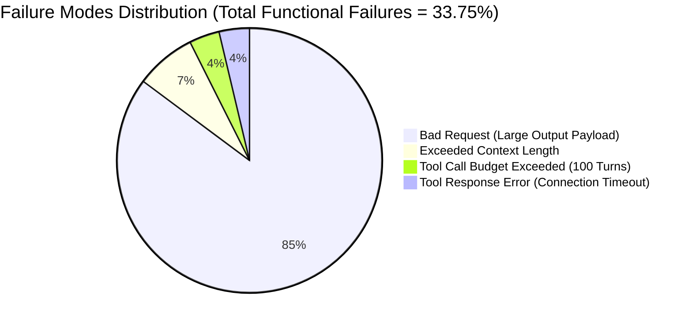

The pie chart above illustrates the breakdown of the $33.75\%$ functional failure rate. Notably, over $92\%$ of all failures stem from payload and context size limits rather than semantic reasoning errors.

### How Each Failure Mode Occurs and How to Recognize It in Logs:

1. **`Bad Request` ($85.2\%$ of failures)**:
   * **Root Cause**: On complex trees with dozens of time points or dense matrices, SIRIO's tool response produces large numeric arrays in the JSON payload. When passed back to the LLM API in subsequent turns, the request payload size exceeds the provider's HTTP request limit.
   * **Log Signature**: `400 Client Error: Bad Request for url: .../chat/completions` or `ProviderError: payload too large`.
2. **`Exceeded Context Length` ($7.4\%$ of failures)**:
   * **Root Cause**: In deeper trees, multi-turn reasoning and tool outputs accumulate beyond the model's context window limit (e.g. $32\text{k}$ or $128\text{k}$ tokens).
   * **Log Signature**: `ContextWindowExceededError` or `Prompt tokens exceed maximum context length`.
3. **`Tool Call Budget Exceeded` ($3.7\%$ of failures)**:
   * **Root Cause**: The agent enters a repetitive or cyclic tool-calling pattern (e.g., iteratively querying place attributes or retrying invalid arc syntax) and reaches `--max-agentic-turn` (default: $100$ turns).
   * **Log Signature**: `[WARNING] Agent exceeded maximum turn budget of 100 turns.`
4. **`Tool Response Error` ($3.7\%$ of failures)**:
   * **Root Cause**: Ephemeral socket drops, JVM memory exhaustion, or network disconnects during SSE HTTP streaming.
   * **Log Signature**: `Connection closed`, `ClosedResourceError()`, or `asyncio.exceptions.TimeoutError`.

> [!TIP]
> **Mitigating Payload and Context Size Failures in Production**:
> To scale MCP-augmented MDE pipelines to industrial systems with thousands of states, implement on-demand pagination for solver output vectors, or allow the agent to execute analysis scripts directly in a sandboxed local environment rather than passing raw JSON vectors over multi-turn chat templates.

---

## 4. Top-Down Probabilistic Fault Tree Generation

To evaluate LLMs across diverse topological structures without model bias, [`TestCaseGenerator.java`](file:///src/main/java/org/util/TestCaseGenerator.java) implements a parameterized, depth-bounded recursive generator.

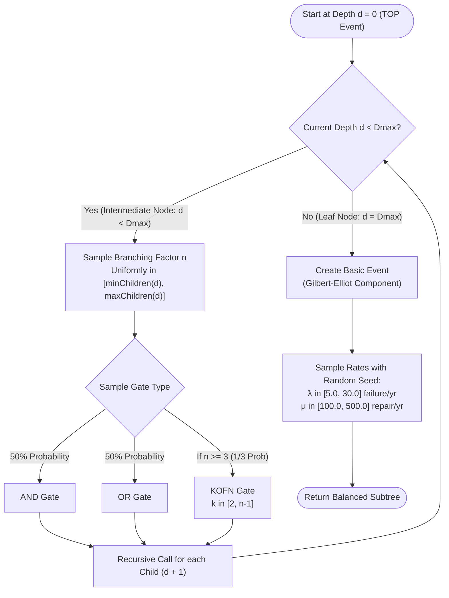

The flowchart above outlines the recursive generation procedure. Starting from the TOP event at depth $d=0$, intermediate nodes sample gate types and children counts until reaching the maximum depth $D_{\max}$, where basic events are instantiated with uniquely sampled physical failure/repair parameters.

### Generation Rules & Structural Constraints:
* **Strict Depth-Bounded Balancing**: All leaf nodes appear strictly at depth $D_{\max} \in \{1, 2, 3\}$. Shallow leaves cannot coexist with deep subtrees, enforcing uniform complexity per tier (`LOW`, `MEDIUM`, `HIGH`).
* **Component Uniqueness**: Each basic event is a uniquely instantiated Gilbert-Elliot component with independently sampled failure rate $\lambda \sim \mathcal{U}(5.0, 30.0)$ and repair rate $\mu \sim \mathcal{U}(100.0, 500.0)$, preventing cross-branch dependencies.
* **Deterministic Seeds**: The global seed is serialized in the dataset header, guaranteeing exact offline replicability.

---

## 5. Model-to-Model Transformation Deep-Dive (FT $\to$ STPN)

To evaluate semantic model transformation capabilities, the agent must translate a Boolean Fault Tree into a Continuous-Time Stochastic Petri Net without access to reference code.

### 5.1 Gilbert-Elliot Component Representation
Every leaf event in the tree represents an independent repairable component modeled as a two-state Gilbert-Elliot GSPN fragment:
* **Places**: `GE_safe` (initial marking $1$), `GE_failed` (initial marking $0$).
* **Transitions**:
  * Exponential failure transition $T_{\text{fail}} \sim \text{Exp}(\lambda)$ moving a token from `GE_safe` to `GE_failed`.
  * Exponential repair transition $T_{\text{rep}} \sim \text{Exp}(\mu)$ with precondition `GE_failed` and postcondition `GE_safe`.

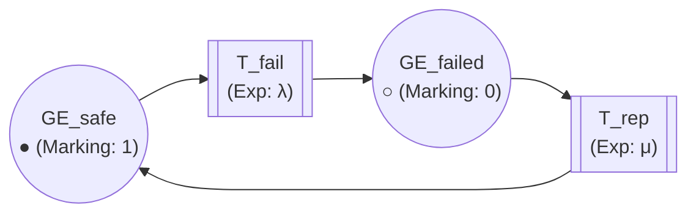

The diagram above illustrates the two-state continuous-time component model. A token resides in `GE_safe` until the exponential failure transition fires, after which the repair transition becomes enabled to return the token to `GE_safe`.

### 5.2 Armed Gate Composition Pattern
Intermediate gates (AND, OR, KOFN) are synthesized using immediate transitions with Boolean enabling conditions and structural guards:

1. **Armed Place Guard**: To prevent infinite instantaneous firing loops in continuous time, every gate transition $T_{\text{gate-fail}}$ requires an input arc from an `armed` place initialized with $1$ token (e.g., `G1_armed = 1`).
2. **Enabling Conditions**: The immediate transition evaluates the status of child places without consuming tokens:
   * **AND Gate**: `GE1_failed > 0 && GE2_failed > 0`
   * **OR Gate**: `GE1_failed > 0 || GE2_failed > 0`
   * **KOFN Gate ($k$-out-of-$n$)**: Sum of failed child markings $\ge k$.
3. **Absorbing System Failure**: The TOP-event failure transition applies an atomic marking update (`marking-update: "p<i> 0"`) that resets all places in the net except `TOP_failed`, making the system failure state mathematically absorbing.

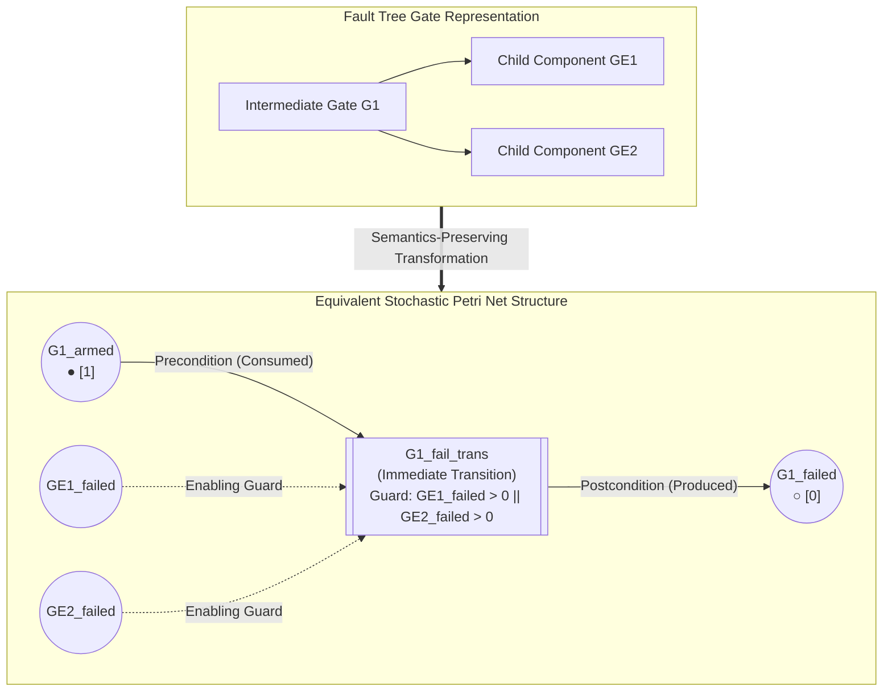

The composition above shows how a Boolean gate (e.g. OR) is mapped to an immediate transition. The enabling guard reads the marking of child places non-destructively, while the token in `G1_armed` is consumed to enforce a single-fire semantics.

### 5.3 TOP Event Absorbing Semantics

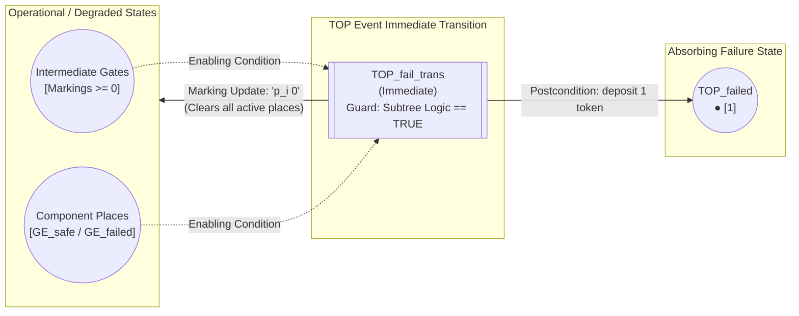

The diagram above models the system failure absorption mechanism. When the root logical condition evaluates to TRUE, the TOP transition fires, resetting all operational places to zero via `marking-update` and placing a token into `TOP_failed`.

---

## 6. Formal Stochastic Engine: Analytical Ground Truth via SIRIO

Unlike benchmarking frameworks that rely on statistical Monte Carlo simulation (which introduces sampling noise and confidence interval variance), `sirio-mcp-bench` uses the formal [SIRIO](https://doi.org/10.1109/TSE.2019.2949806) engine to compute **exact analytical ground truths**.

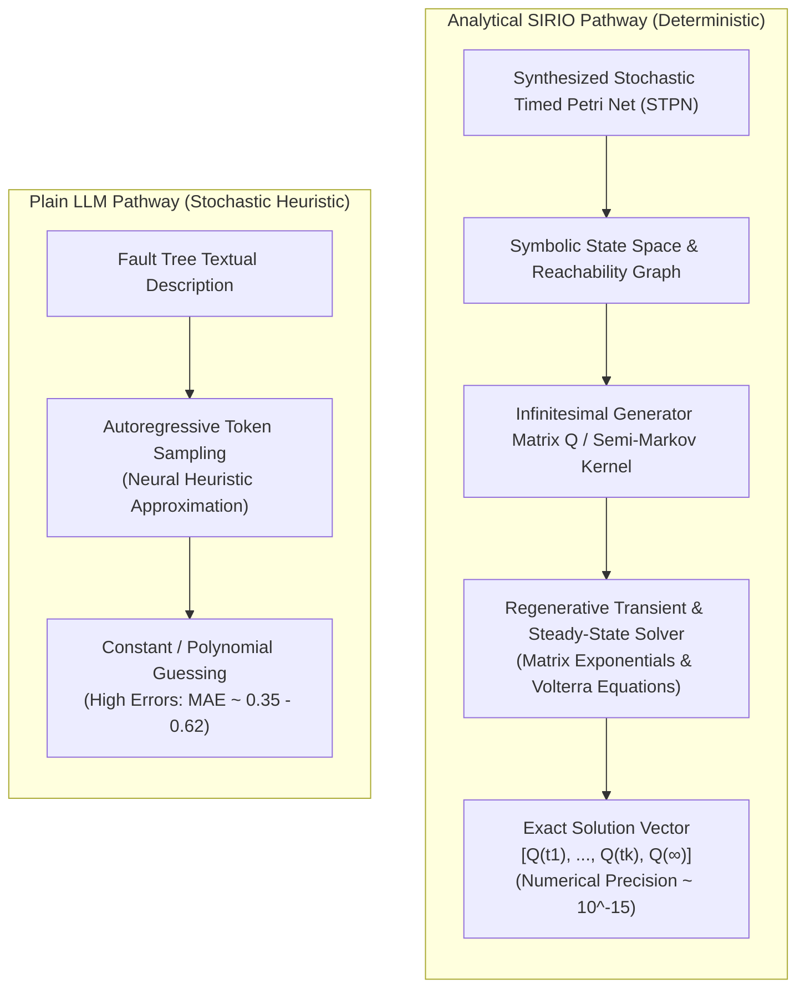

The parallel comparison above contrasts the deterministic numerical approach against autoregressive neural inference. SIRIO builds the exact reachability graph and computes matrix exponentials, ensuring floating-point precision ($10^{-15}$), while the plain LLM attempts uncalibrated statistical guessing.

### Formal Reliability Metrics Defined:
* **Transient Unreliability $Q(t)$**: The probability that the system experiences failure at or before time $t$:
  $$Q(t) = P(T_{\text{failure}} \le t) \quad \text{for } t \in [0, T]$$
  In repairable systems with an absorbing TOP event, $Q(t)$ is monotonically increasing and represents the probability mass accumulated in place `TOP_failed`. Evaluated analytically via uniformization (Jensen's method):
  $$\mathbf{p}(t) = \mathbf{p}(0) e^{\mathbf{Q} t} = \mathbf{p}(0) \sum_{k=0}^{\infty} \frac{(\mathbf{Q} t)^k}{k!}$$
* **Steady-State Unavailability $Q(\infty)$**: The asymptotic probability that the system is in a failed state as $t \to \infty$:
  $$Q(\infty) = \lim_{t \to \infty} Q(t)$$
  When system failure is modeled as absorbing, $Q(\infty) = 1.0$; for non-absorbing repairable topologies, it represents the stationary availability distribution $\boldsymbol{\pi} \mathbf{Q} = \mathbf{0}$.

---

## 7. System Architecture & Polymorphic Implementation

The framework requires **Java 25** and **Python 3.10+**, organizing responsibilities across clean object-oriented abstractions.

### 7.1 Java Backend & Spring AI MCP Server (`src/main/java`)

The Spring Boot application (`org.swam.sirio_mcp_server`) exposes **29 atomic tools** categorized into five functional groups:

| Category | Available Tools | Description |
| :--- | :--- | :--- |
| **Lifecycle & Inspection** | `create`, `show_net`, `export_petri_net_graph`, `get_net_features`, `get_place_features`, `get_transition_features` | Initializes Petri net instances and queries structural features |
| **Places & Tokens** | `add_places`, `remove_places`, `add_tokens`, `set_tokens`, `get_tokens` | Manages places and marking configurations |
| **Transitions** | `add_transitions`, `remove_transitions`, `add_EXP`, `add_IMM`, `add_DET`, `add_UNI`, `add_GEN` | Configures stochastic, immediate, and deterministic transitions |
| **Arcs & Logic Guards** | `add_precondition`, `remove_precondition`, `add_postcondition`, `remove_postcondition`, `add_inhibitor_arc`, `add_enabling_function`, `add_marking_update` | Defines topological connectivity, Boolean firing guards, and marking resets |
| **Numerical Solvers** | `execute_transient_analysis`, `execute_steady_state_analysis` | Delegates formal numerical analysis to the SIRIO engine |

### 7.2 Transport Layer: SSE vs Stdio Protocol Architecture

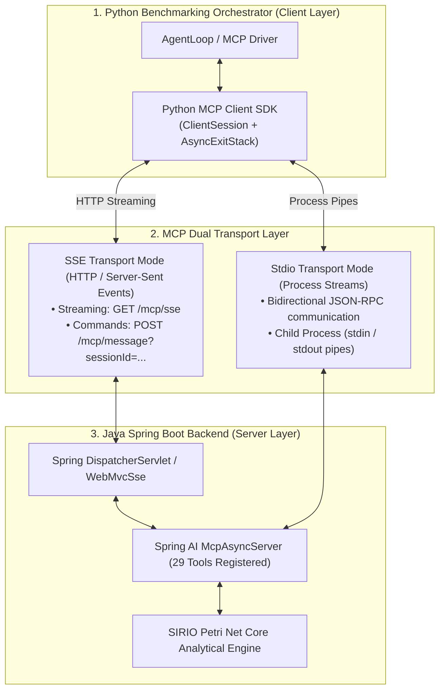

The multi-tier architectural diagram above depicts how the Python runner connects to the Java backend. Users can select `--mcp-mode sse` (connecting over HTTP SSE for live server inspection) or `--mcp-mode stdio` (spawning isolated Java processes per run).

### 7.3 Modular Python Class Architecture & Polymorphism (`python_runner/`)

The Python codebase uses polymorphism to expose interchangeable model backends and MCP client transports:

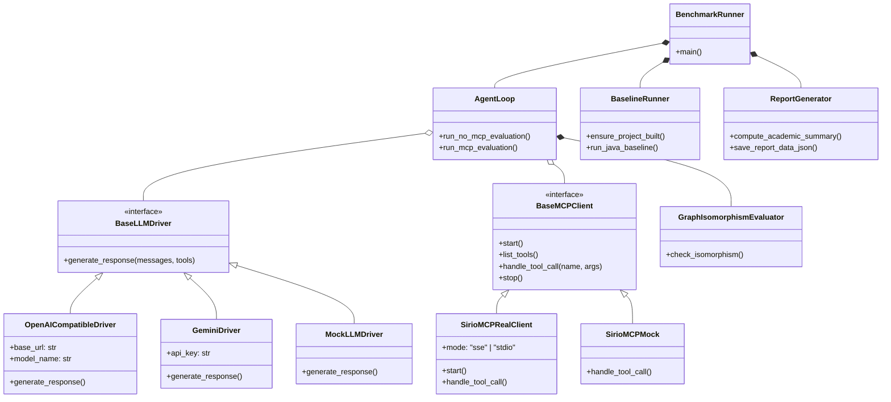

The class diagram above highlights the modular composition in `python_runner`. `AgentLoop` orchestrates polymorphic LLM drivers (`OpenAICompatibleDriver`, `GeminiDriver`, `MockLLMDriver`) and polymorphic MCP clients (`SirioMCPRealClient`, `SirioMCPMock`) seamlessly without coupling.

---

## 8. End-to-End Execution Flow & Multi-Turn State Machine

The benchmark executes three distinct phases for each test case:

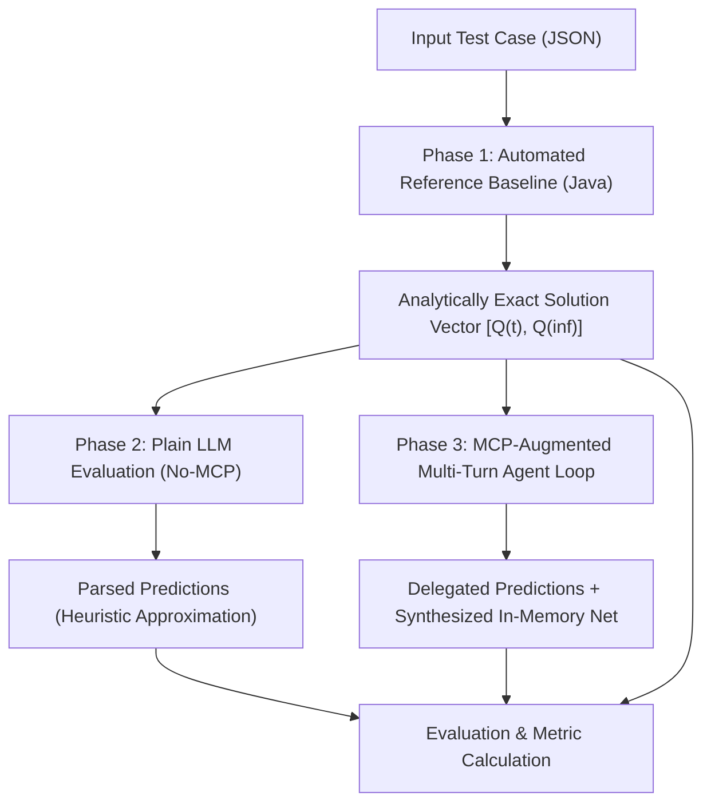

The 3-phase execution pipeline above illustrates the benchmarking lifecycle: first, Java computes the analytical ground truth vector; second, the Plain LLM generates its unaugmented response; third, the MCP agent builds and solves its net over multiple turns.

### 8.1 Multi-Turn Agent State Machine

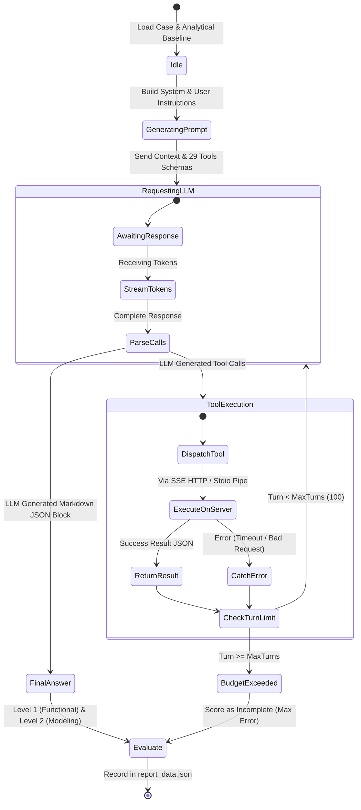

The state diagram above illustrates the internal agentic loop. The agent iterates between generating tool calls and receiving environment feedback until it either produces the final JSON block or hits the maximum turn limit.

### 8.2 Sequence Diagram: Complete Tool Invocation Protocol

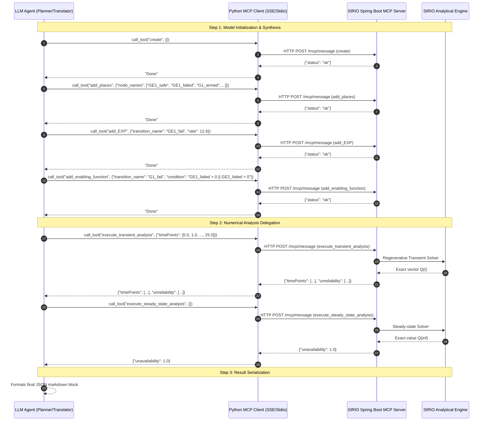

The sequence diagram above documents the complete conversational interaction protocol, showing the explicit handshake, tool calls, formal solver execution, and return payloads.

---

## 9. Dual-Level Evaluation Framework & Graph Isomorphism

To disentangle the LLM's capacity to perform **semantic model-to-model transformations** from infrastructural text-serialization errors, `sirio-mcp-bench` uses a two-level evaluation strategy:

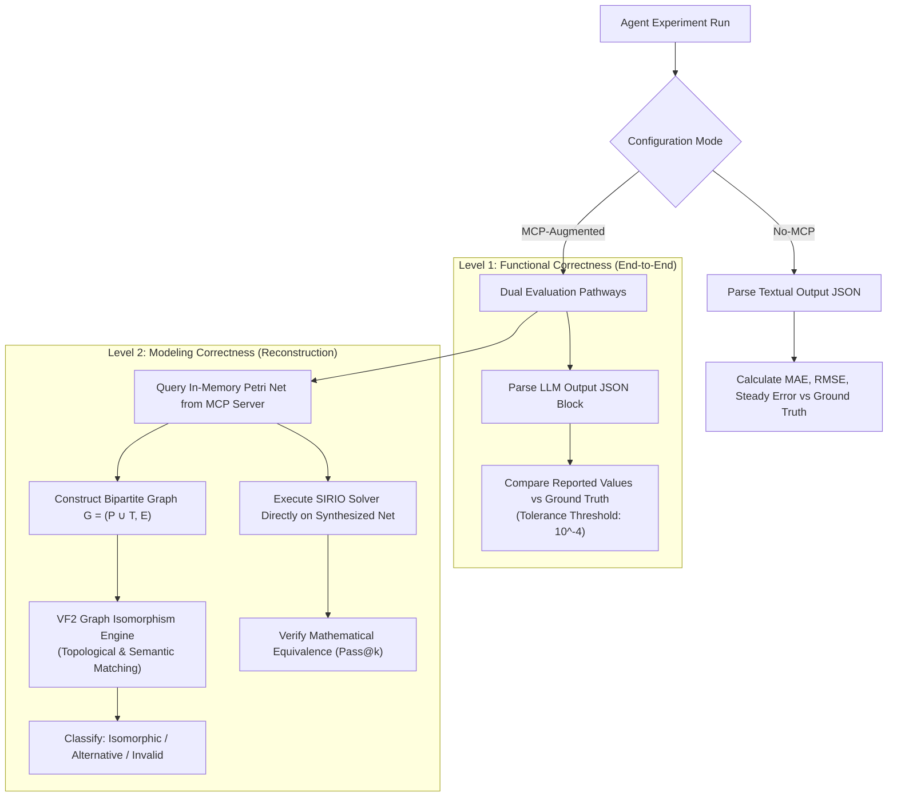

The dual-level evaluation flowchart above shows how MCP runs are evaluated both at the surface JSON level (Level 1) and by directly inspecting the in-memory Petri net via programmatic execution and the VF2 graph isomorphism engine (Level 2).

> [!NOTE]
> ### Why Dual-Level Evaluation Is Essential
> In standard LLM benchmarks, an agent that constructs a mathematically flawless Petri Net but fails to print the final JSON block (e.g., due to output token limits or network interruption) is scored as 0% accurate. Level 2 Modeling Correctness solves this by executing SIRIO directly against the agent's synthesized model in server memory, proving that **the model-to-model transformation itself succeeded**.

### 9.1 Graph Isomorphism Verification (VF2 Algorithm)
Using [`graph_isomorphism.py`](file:///python_runner/graph_isomorphism.py), the synthesized Petri net is transformed into a directed bipartite graph $G = (P \cup T, E)$ with node attributes (place tokens, transition rates, enabling conditions) and compared against the reference ground-truth graph using NetworkX's VF2 isomorphism engine.

### 9.2 Mathematical Metrics Formulation & Concrete Examples

* **Transient Mean Absolute Error (MAE)**:

  $$\text{MAE}_{\text{transient}} = \frac{1}{K} \sum_{i=1}^K |Q_{\text{pred}}(t_i) - Q_{\text{truth}}(t_i)|$$

  *Example*: Across 25 time points, if reported unreliability is $0.05$ at $t=1$ (ground truth $0.050002$), the error is $2 \times 10^{-6}$.

* **Transient Root Mean Squared Error (RMSE)**:

  $$\text{RMSE}_{\text{transient}} = \sqrt{\frac{1}{K} \sum_{i=1}^K \left(Q_{\text{pred}}(t_i) - Q_{\text{truth}}(t_i)\right)^2}$$

* **Steady-State Absolute Error**:

  $$\text{Error}_{\text{steady}} = |Q_{\text{pred}}(\infty) - Q_{\text{truth}}(\infty)|$$

* **Pass Criterion ($\tau = 10^{-4}$)**: A run passes if and only if:

  $$\max\left(\text{MAE}_{\text{transient}},\, \text{Error}_{\text{steady}}\right) \le 10^{-4}$$

* **Pass@k Unbiased Estimator**:

  $$\text{Pass@}k = 1 - \frac{\binom{n - c}{k}}{\binom{n}{k}}$$

  *Example*: For $n=5$ samples where $c=3$ runs passed, $\text{Pass@}1 = 1 - \frac{\binom{2}{1}}{\binom{5}{1}} = 1 - \frac{2}{5} = 60.0\%$, and $\text{Pass@}5 = 1 - \frac{\binom{2}{5}}{\binom{5}{5}} = 100.0\%$.

---

## 10. Prompt Engineering & Formal Semantic Guards

To prevent prompt bias and maintain reproducibility, both configurations receive standardized prompt structures.

### System Instructions Excerpt & Rationale

```text
You are a reliability engineering expert specializing in quantitative fault tree analysis.
Your task is to compute the exact steady-state unavailability and transient unreliability curves.
Even if the limiting unreliability is known to converge to a certain value (e.g. 1.0), you MUST NOT
skip the formal derivation steps.

[PETRI NET MODELING RULES]
1. Model each component as a Gilbert-Elliot net: failure rate (lambda) and repair rate (mu).
2. Every intermediate gate failure transition MUST have an explicit input arc from a dedicated
   "armed" place with initial marking 1 (e.g. "<gate>_armed = 1").
3. The top-event place has no repair arc (system failure is absorbing).
4. The top-event transition's marking-update must explicitly zero every place in the net except
   the top-event place (syntax: "p<i> 0" for each place).
5. Use "&&" for AND and "||" for OR in all enabling functions.

[ORCHESTRATION DIRECTIVES]
If external tools are available in your environment, you MUST use them as early as possible to
construct the model and delegate all formal computations. Do NOT approximate math manually.
```

### User Prompt Template

```text
Perform both the steady-state unavailability analysis and the transient unreliability analysis
for the following event configuration:
- Fault Tree Logic Expression: {logic_expression}
- Transient Analysis Parameters:
  * timeStep: {time_step}
  * maxTime: {max_time}
- Components:
{components_details}

Append your final quantitative result at the very end of your response in a fenced JSON block:
```json
{
  "steady_state": <float>,
  "transient": [
    {"time": 0.0, "unreliability": <float>},
    ...
  ]
}
```
```

---

## 11. Repository Structure & Java Framework Deep-Dive

```text
sirio-mcp-bench/
├── .env.example                  # Environment variables template (API keys)
├── pom.xml                       # Maven build descriptor (Java 25, Spring Boot, Spring AI MCP)
├── test_cases.json               # Full benchmark dataset (100 generated cases)
├── test_cases_medium.json        # Reference evaluation dataset (16 cases, Medium tier)
├── test_cases_example.json       # Minimal smoke-test dataset (1 case)
├── ComponentGSPNs/               # XPN template definitions for basic components
│   └── gilbertElliotComponent.xpn
├── src/main/java/org/            # Java 25 Formal MDE Framework
│   ├── analysis/                 # Transient and steady-state analysis runners
│   │   ├── TransientAnalysisRunner.java
│   │   └── SteadyStateAnalysisRunner.java
│   ├── faultTree/                # Fault Tree AST, Gate Nodes & GSPN Composers
│   │   ├── FaultTree.java        # Core Fault Tree container
│   │   ├── GateNode.java         # AND, OR, KOFN composition abstractions
│   │   ├── ComponentNode.java    # Gilbert-Elliot component wrapper
│   │   └── GSPN.java             # Generalised Stochastic Petri Net model wrapper
│   ├── system/                   # Component-based system abstractions
│   │   ├── ComponentBasedSystem.java
│   │   └── MultiComponentSystem.java
│   ├── swam/
│   │   ├── pn_utils/             # Petri Net validation and export utilities
│   │   └── sirio_mcp_server/     # Spring AI MCP Server
│   │       ├── SirioMcpServerApplication.java
│   │       ├── SirioService.java # 29 Atomic MCP Tools
│   │       └── CorsConfig.java
│   └── util/
│       ├── SirioCLI.java         # Analytical Ground Truth solver CLI
│       ├── TestCaseGenerator.java# Top-down recursive Fault Tree generator
│       ├── FaultTreeParser.java  # Logic expression parser
│       ├── PetriNetBuilder.java  # Reference FT-to-Petri-Net compiler
│       └── XpnToSirioConverter.java
├── python_runner/                # Modular Python Benchmarking Orchestrator (SOLID)
│   ├── benchmark_runner.py       # Main CLI entry point
│   ├── agent_loop.py             # LLM turn loop & prompt dispatcher
│   ├── mcp_client.py             # Real (SSE/Stdio) and Mock MCP clients
│   ├── baseline_runner.py        # Automated Maven build & Java baseline solver
│   ├── report_generator.py       # Academic summary, metrics & JSON serialization
│   ├── graph_isomorphism.py      # NetworkX Petri Net topological comparator
│   ├── plotter.py                # Comparison curve generator (matplotlib)
│   ├── progress_tracker.py       # CLI progress bar and ETA monitor
│   ├── exceptions.py             # Custom benchmarking exception hierarchy
│   ├── llm_client.py             # OpenAI-compatible, Gemini & Mock drivers
│   └── utils.py                  # Stateless data cleaning utilities
└── output/                       # Output artifact directory (generated dynamically)
    ├── benchmark/                # Markdown interaction traces & curve plots
    └── experiments/              # Timestamped folders with report_data.json & report_summary.json
```

---

## 12. Installation & Prerequisites

### 12.1 Software Requirements
* **Java Development Kit (JDK)**: Version **25** (tested on OpenJDK 25 and Oracle JDK 25).
* **Apache Maven**: Version **3.9+**.
* **Python**: Version **3.10+** (recommended: Anaconda / Miniconda).

### 12.2 Environment Setup

1. **Clone the repository**:
   ```bash
   git clone https://github.com/nicolo-pollini-unifi/sirio-mcp-bench.git
   cd sirio-mcp-bench
   ```

2. **Set up the Python Conda environment**:
   ```bash
   conda create -n sirio-mcp-bench python=3.11 -y
   conda activate sirio-mcp-bench
   pip install openai google-genai mcp matplotlib numpy networkx python-dotenv
   ```

3. **Configure API Keys**:
   Create a `.env` file in the project root:
   ```bash
   # .env
   OPENAI_API_KEY=sk-or-v1-your-openrouter-or-openai-key
   GEMINI_API_KEY=your-google-ai-studio-key
   ```

> [!CAUTION]
> **Keep Credentials Secure**: Never commit `.env` files or hardcode API keys into test scripts. `sirio-mcp-bench` automatically loads `.env` variables via `python-dotenv`.

4. **Build the Java Project & Generate Classpath**:
   The Python runner handles compilation and classpath extraction automatically upon launch via `baseline_runner.py`. To compile manually:
   ```bash
   # On Windows PowerShell:
   mvn compile dependency:build-classpath "-Dmdep.outputFile=classpath.txt"
   mvn package -DskipTests

   # On Linux / macOS:
   mvn compile dependency:build-classpath -Dmdep.outputFile=classpath.txt
   mvn package -DskipTests
   ```

---

## 13. Step-by-Step Reproduction Guide

### 13.1 Reproduce the Full Paper Experiment ($N=16$, 5 Samples, Qwen 27B)
To replicate the exact experimental results reported in Table 1 using OpenRouter (`qwen/qwen3.5-27b`) or a local endpoint:

```bash
conda activate sirio-mcp-bench

python python_runner/benchmark_runner.py \
  --config test_cases_medium.json \
  --provider openai \
  --openai-url https://openrouter.ai/api/v1 \
  --openai-model qwen/qwen3.5-27b \
  --samples 5 \
  --mcp-mode sse \
  --temperature 0.2 \
  --output-dir output/benchmark
```

### 13.2 Fast Single-Case Evaluation (Smoke Test)
To verify the entire toolchain on a single case (`generated_case_4`) with 1 sample:

```bash
conda activate sirio-mcp-bench

python python_runner/benchmark_runner.py \
  --config test_cases_medium.json \
  --case generated_case_4 \
  --provider openai \
  --openai-url https://openrouter.ai/api/v1 \
  --openai-model qwen/qwen3.5-27b \
  --samples 1 \
  --mcp-mode sse
```

### 13.3 Offline Mock Evaluation (No API Key Required)
To validate the orchestrator pipeline, baseline compilation, plotting engine, and summary calculation without invoking remote LLMs:

```bash
python python_runner/benchmark_runner.py \
  --config test_cases_example.json \
  --provider mock \
  --mcp-mode mock \
  --samples 1
```

### 13.4 Available CLI Parameters

| Parameter | Default | Description |
| :--- | :--- | :--- |
| `--config` | `test_cases_example.json` | Path to dataset JSON file |
| `--provider` | `gemini` | LLM backend: `openai`, `gemini`, or `mock` |
| `--openai-url` | `http://localhost:8000/v1` | Base URL for OpenAI-compatible endpoint |
| `--openai-model` | `qwen-2.5-coder-32b` | Model identifier |
| `--samples` | `1` | Number of independent samples per case ($n$) |
| `--case` | `None` | Filter to run only a specific case ID (e.g. `--case generated_case_4`) |
| `--mcp-mode` | `mock` | MCP connection mode: `sse`, `stdio`, or `mock` |
| `--sse-url` | `http://localhost:8081/sse` | MCP server SSE endpoint URL |
| `--temperature` | `0.0` | Sampling temperature for LLM generation |
| `--max-agentic-turn` | `100` | Turn budget limit for the agent loop |
| `--stream` | `False` | Stream model tokens in real-time to stdout |
| `--verbose-interactions`| `False` | Print raw JSON tool requests and responses |

---

## 14. Generating Custom Datasets & Extending the Benchmark

The top-down recursive generator ([`TestCaseGenerator.java`](file:///src/main/java/org/util/TestCaseGenerator.java)) constructs balanced, depth-bounded Fault Tree datasets.

### Structural Complexity Tiers
* **`LOW`** ($D_{\max} = 1$): Single-gate shallow trees.
* **`MEDIUM`** ($D_{\max} = 2$): 2-level hierarchy with nested AND/OR/KOFN subtrees ($5 \le \text{Leaves} \le 12$).
* **`HIGH`** ($D_{\max} = 3$): 3-level deep hierarchy with large Markovian state spaces ($15 \le \text{Leaves} \le 30$).

### Generation Command
Generate a new dataset with custom seed, difficulty, and case count:

```bash
# Generate 20 test cases of HIGH complexity with seed 123
java -cp "target/classes;$(cat classpath.txt)" org.util.TestCaseGenerator \
  --difficulty HIGH \
  --numCases 20 \
  --seed 123 \
  --output test_cases_high_custom.json
```

Then execute the benchmark on the custom dataset:
```bash
python python_runner/benchmark_runner.py --config test_cases_high_custom.json --samples 3 ...
```

---

## 15. Citation & Research Team

If you use this benchmark, codebase, or findings in your research, please cite our paper:

```bibtex
@inproceedings{sciammacca2026assessing,
  author    = {Sciammacca, Filippo and Menghini, Niccol{\`o} and Pollini, Nicol{\`o} and Becattini, Marco and Vicario, Enrico},
  title     = {Assessing the Impact of MCP-Augmented LLMs in MDE Tasks: A Quantitative Comparative Evaluation Framework on Fault Tree Modeling and Analysis Through Petri Nets},
  booktitle = {Proceedings of the ACM/IEEE 29th International Conference on Model Driven Engineering Languages and Systems (MODELS Companion '26)},
  year      = {2026},
  month     = {10},
  location  = {M{\'a}laga, Spain},
  publisher = {ACM},
  address   = {New York, NY, USA},
  doi       = {10.1145/3837062.3839378},
  url       = {https://doi.org/10.1145/3837062.3839378}
}
```

### Research Inquiries & STLab Team
* **Filippo Sciammacca**: `filippo.sciammacca@unifi.it`
* **Niccolò Menghini**: `niccolo.menghini@unifi.it`
* **Nicolò Pollini**: `nicolo.pollini@unifi.it`
* **Marco Becattini**: `marco.becattini@unifi.it`
* **Enrico Vicario**: `enrico.vicario@unifi.it`
* **Software Technologies Lab (STLab)**: [https://stlab.dinfo.unifi.it](https://stlab.dinfo.unifi.it)  
  Department of Information Engineering (DINFO), University of Florence, Italy.